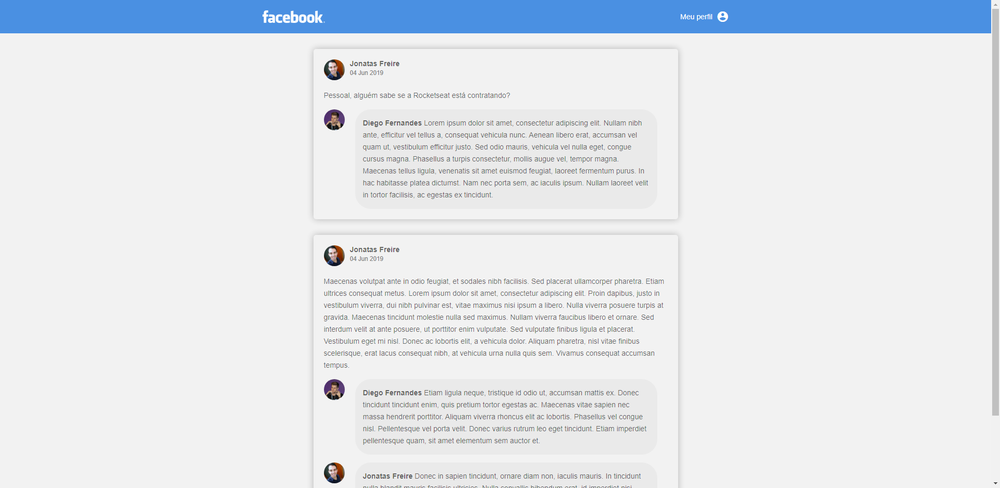

# My first app with ReactJS

This is my first step with ReactJS and I love It.

Every time I'm discover a new something in this universe of Javascript, I think It's so nice and I get so excited to learn more and more about it.

<h3>About this mini project</h3>

This is a Rocketseat Bootcamp challenge, basically, Its just a static page and based on Facebook where there is posts and comentery

I learned the base of ReactJS and yours components, a little of props and how to pass It to other components, the base of Babel and WebPack and how configure the two of them

Although It's a simple project, Already It's a begining.

Thanks :)

